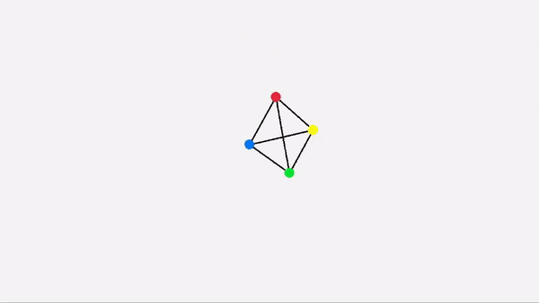

# Spring Physics Simulation

## About The Project

This project demonstrates a basic spring physics implemented using the C programming language. The aim is to simulate the behavior of particles connected by springs, adhering to the principles of Hooke's Law.

Using spring physics, it is possible to create a lot of other types of simulation e.g. soft body and cloth simulation. 
